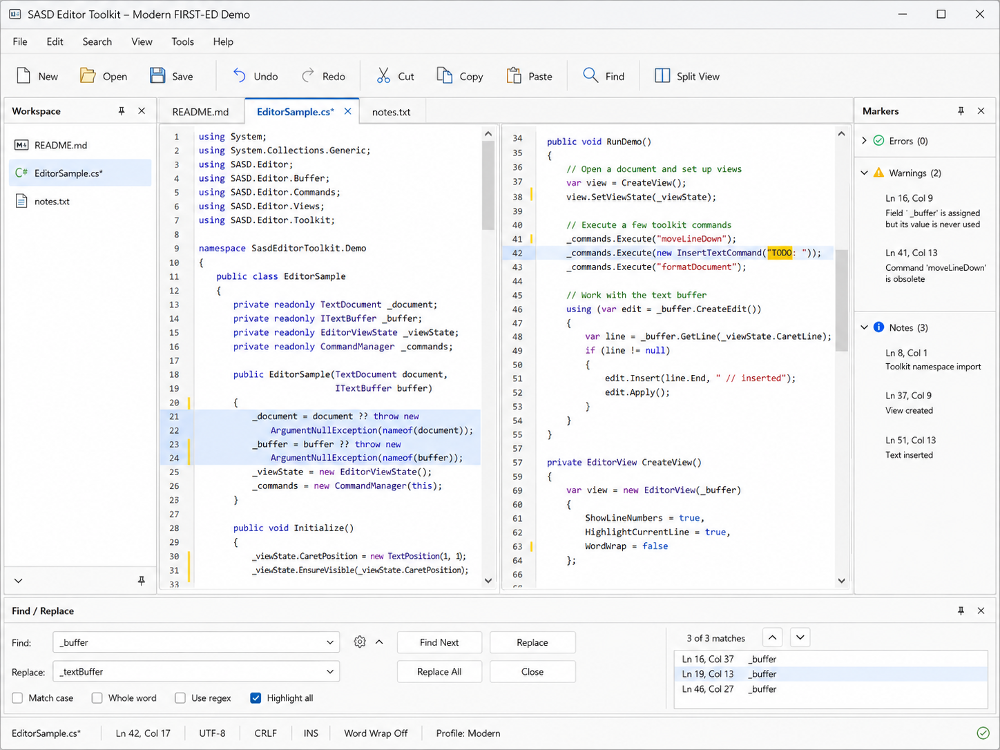

# SASD Editor Toolkit

A modern C#/.NET reference implementation of the classic editor-toolbox idea: a reusable, UI-independent text editing core with a first WinForms adapter and practical documentation for future ports.



## What this repository is

`SASD-Editor-Toolkit` is intended to become a small, understandable editor construction kit, not a full IDE and not a wrapper around one specific UI control.

The initial product line is:

```text
Host / Sample applications
        |
        v
Sasd.EditorToolkit.WinForms
        |
        v
Sasd.EditorToolkit.Core
        |
        v
BCL + host-provided services
```

The first milestone is **Modern FIRST-ED 0.1**: a minimal but real editor core, a WinForms demo, tests, and stable architectural seams.

## Current status

This ZIP is a **repository seed**. It contains:

- project structure for Core, WinForms adapter, WinForms sample and Core tests;
- foundational C# classes for documents, text buffers, positions, ranges, commands, undo, storage and workspace;
- initial specification documents and ADRs;
- imported German Lastenheft/Pflichtenheft documents;
- a roadmap that prevents the full Pflichtenheft from becoming the M1 scope.

Because this seed was generated in an environment without the .NET SDK, it should be treated as carefully prepared source material. Run the build locally before the first commit.

## Build

Expected local toolchain:

- .NET SDK 10.x
- Windows for the WinForms project and sample
- Git

```powershell
dotnet restore .\SASD-Editor-Toolkit.sln
dotnet build .\SASD-Editor-Toolkit.sln -c Debug
dotnet test .\SASD-Editor-Toolkit.sln -c Debug
```

On Linux you can work on docs and the Core project, but the WinForms project targets `net10.0-windows`.

## Project layout

```text
.github/workflows/               CI seed
assets/screenshots/              README and UI concept screenshots
docs/adr/                        architecture decision records
docs/de/                         German Lastenheft and Pflichtenheft
docs/spec/                       small language-neutral practical specs
src/Sasd.EditorToolkit.Core/     UI-independent editor core
src/Sasd.EditorToolkit.WinForms/ WinForms adapter and editor surface
samples/...FirstEd.WinForms/     Modern FIRST-ED demo app
tests/...Core.Tests/             Core tests
```

## Language strategy

C#/.NET is the first and reference implementation. That does not mean that C# details define the whole product forever. Shared concepts, command IDs, settings, keyboard profiles and conformance test vectors are documented in `docs/spec/` so that later Java, C++, Web or limited PHP integration can reuse knowledge.

The basic rule is:

> Same concepts, same behavior, same command IDs, idiomatic APIs per language.

See `docs/de/Mehrsprachenstrategie.md`.

## M1 scope guard

The full Pflichtenheft is a product backlog, not a single first sprint. M1 is intentionally limited to:

- `TextDocument`
- `LineTextBuffer`
- `TextPosition` and `TextRange`
- basic insert, delete and newline operations
- dirty state
- minimal undo/redo
- file load/save
- basic command dispatcher
- a small WinForms demo
- tests and architecture rules

Everything else is planned, but later: full MicroStar-like demo, advanced blocks, markers, word-wrap/reformat, syntax highlighting, WPF, Web, Large File buffer and plugins.

## Legal note

This project is an independent SASD implementation. Do not copy Borland source code, manual scans, logos, cover art or product identity into this repository. Historical names may only be used in documentation as references.
